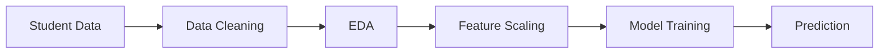

<h1 align="center">🎓 Student Placement Prediction</h1>

<p align="center">
  🤖 Machine Learning Project | 📊 Classification Model | 🎯 Placement Prediction
</p>

<p align="center">
  
  
  
</p>

---

## 📌 About the Project

This project predicts whether a **student will be placed or not** based on academic and personal features.

📊 It helps institutions and students understand placement chances using **Machine Learning**.

---

## 🎯 Features Used

* 👤 Gender
* 📊 CGPA
* 💼 Internship Experience
* 📚 Academic Performance
* 🧠 Skills / Other Factors

---

## ⚙️ Tech Stack

✨ Tools & Libraries:

* 🐍 Python
* 📊 Pandas
* 🔢 NumPy
* 🤖 Scikit-learn
* 📈 Matplotlib / Seaborn

---
---

## 🛠️ Installation

### 1. Clone the repository

```bash
git clone https://github.com/haseebniazii/student-placement-prediction.git
cd student-placement-prediction

## 🔄 Project Workflow



---

## 📊 Model Performance

The classification model achieved an accuracy of approximately **77%** on the test data.

* 🎯 **Accuracy:** 77%
* 🤖 **Task:** Student Placement Classification
* 📈 **Evaluation:** Test Dataset

---

## 📁 Project Structure

```text
student-placement-prediction/
│
├── placement.csv
├── student_placement_prediction.ipynb
└── README.md
```

---

## 🚀 Future Improvements

* 🔹 Try Random Forest and other classification algorithms
* 🔹 Perform hyperparameter tuning
* 🔹 Improve model accuracy
* 🔹 Deploy the model as a web application

---

## 👨‍💻 Author

**Haseeb Khan**

🔗 GitHub: `https://github.com/haseebniazii`
